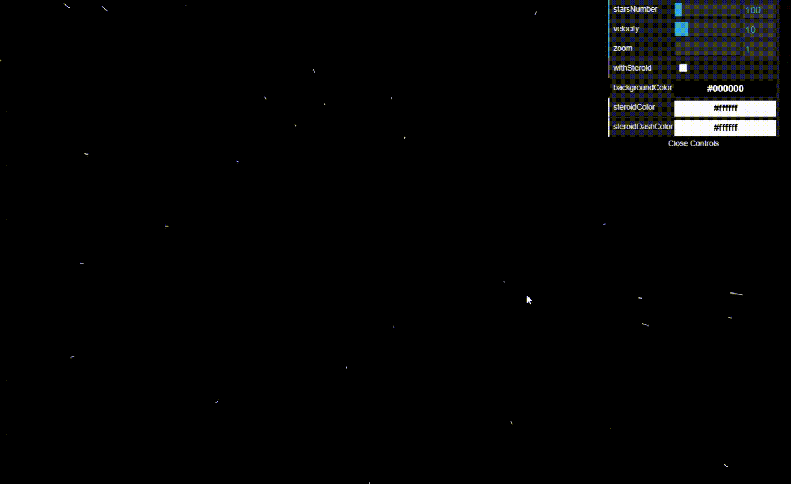
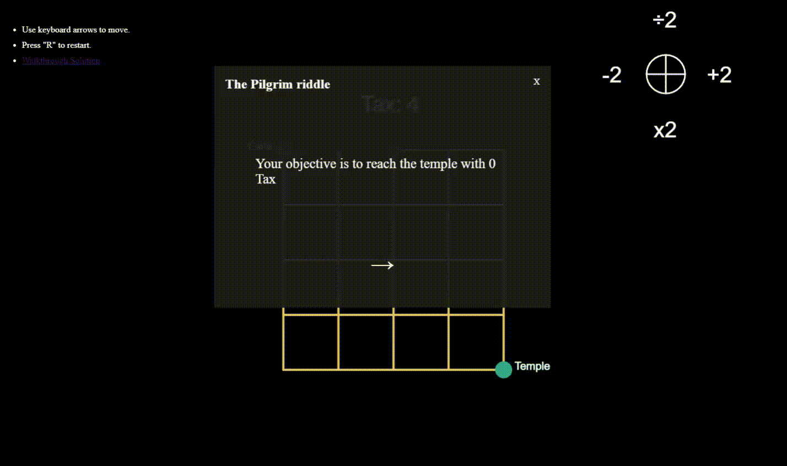

[![LinkedIn-FrontEnd][linkedin-shield]][linkedin-url-1]

# Code challenge

<!--

  

    <a href="https://toshiuk.github.io/code-challenge/starfield/">View project</a>
  

  

 -->

<!-- ABOUT THE PROJECT -->

## About The Project

I will be adding in this repository a bunch of projects, which will be mainly focused on the artistic scope, but not restricted. Browse through the projects and enjoy, if you think you can improve anything, don't hesitate to create a pull request.

## Projects (Click in the image to preview it)

|                                                                                                                                            |                                                                                                                                    |
| ------------------------------------------------------------------------------------------------------------------------------------------ | ---------------------------------------------------------------------------------------------------------------------------------- |
| 
Starfield 
              | 
Purple rain 
 |
| 
Terrain flight 
 | 
 Pilgrim riddle 
   |
| 
 Stout (FrankerZ copy) 
         |                                                                                                                                    |

More info inside each project folder ;)

<!-- MARKDOWN LINKS & IMAGES -->

[linkedin-shield]: https://img.shields.io/badge/-LinkedIn-black.svg?style=flat-square&logo=linkedin&colorB=555
[linkedin-url-1]: https://linkedin.com/in/flaviotoshiukhjr
